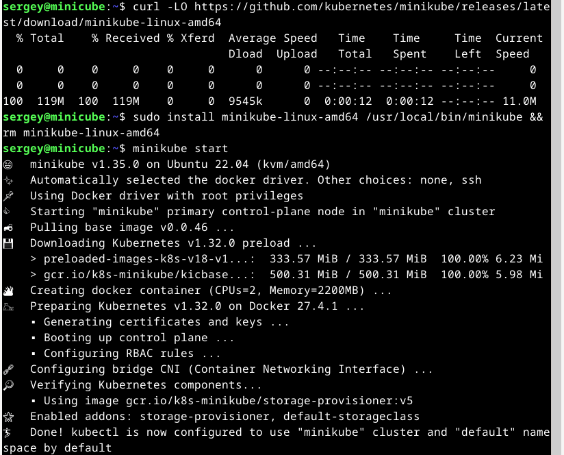
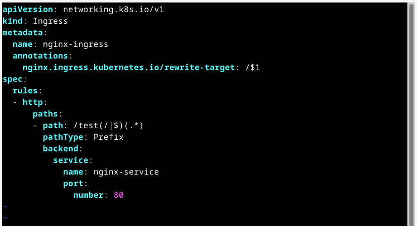

# Домашнее задание к занятию «Kubernetes. Часть 1». Потапчук Сергей.

Это задание для самостоятельной отработки навыков и не предполагает обратной связи от преподавателя. Его выполнение не влияет на завершение модуля. Но мы рекомендуем его выполнить, чтобы закрепить полученные знания.

---

### Задание 1

**Выполните действия:**

1. Запустите Kubernetes локально, используя k3s или minikube на свой выбор.
1. Добейтесь стабильной работы всех системных контейнеров.

### Решение

1. Создал ВМ 4 CPU, 8 Gb RAM, 50 Gb SSD.

2. Установил Docker по инструкции с оффициального сайта.

3. Установил kubectl по инструкции с оффициального сайта Kubernetes.

```
curl -LO "https://dl.k8s.io/release/$(curl -L -s https://dl.k8s.io/release/stable.txt)/bin/linux/amd64/kubectl"
sudo install -o root -g root -m 0755 kubectl /usr/local/bin/kubectl
```


4. Установил minicube по инструкции с оффициального сайта, и стартанул.

```
curl -LO https://github.com/kubernetes/minikube/releases/latest/download/minikube-linux-amd64
sudo install minikube-linux-amd64 /usr/local/bin/minikube && rm minikube-linux-amd64
minikube start
```



проверил поды

```
kubectl get po -A
```


```
kubectl get po -n kube-system
```


---

### Задание 2

Есть файл с деплоем:

```
apiVersion: apps/v1
kind: Deployment
metadata:
  name: redis
spec:
  selector:
    matchLabels:
      app: redis
  replicas: 1
  template:
    metadata:
      labels:
        app: redis
    spec:
      containers:
      - name: master
        image: bitnami/redis
        env:
         - name: REDIS_PASSWORD
           value: password123
        ports:
        - containerPort: 6379
```


**Выполните действия:**

1. Измените файл с учётом условий:

 * redis должен запускаться без пароля;
 * создайте Service, который будет направлять трафик на этот Deployment;
 * версия образа redis должна быть зафиксирована на 6.0.13.

2. Запустите Deployment в своём кластере и добейтесь его стабильной работы.

### Решение

[Файл](deployment.yaml) с деплоем.

```
kubectl apply -f deployment.yaml
kubectl get deploy
kubectl get rs
kubectl get po
```


```
kubectl run -it --rm redis-test --image=redis --restart=Never -- redis-cli -h redis-service
```


```
SET test "hello"
GET test
exit
```


---

### Задание 3

**Выполните действия:**

1. Напишите команды kubectl для контейнера из предыдущего задания:

 - выполнения команды ps aux внутри контейнера;
 - просмотра логов контейнера за последние 5 минут;
 - удаления контейнера;
 - проброса порта локальной машины в контейнер для отладки.

### Решение

 - для выполнения команды ps aux внутри контейнера:

```
kubectl exec -it <имя-контейнера> -- ps aux
```


 - для просмотра логов контейнера за последние 5 минут:

```
kubectl logs --since=5m <имя-контейнера>
```

в моем случае логов за 5 последние 5 минут нет, а вот за 1 час есть


 - для удаления контейнера:

```
kubectl delete pod <имя-контейнера>
```


как видим, сразу после удаления был создан новый контейнер

 - для проброса порта локальной машины в контейнер для отладки:

в первом терминале

```
kubectl port-forward pod/<имя-контейнера> 6379:6379
```


во втором терминале

```
sudo lsof -i :6379
redis-cli -h 127.0.0.1 PING
```


во время команды PING в первом терминале


в первом терминале завершаю команду (^C) и она автоматически освобождает порт

Необходимо помнить, что kubectl port-forward - это не демон, а активный процесс:

   - Он занимает порт, пока работает

   - При завершении (^C) автоматически освобождает порт

Также можно (и я бы сказал нужно, далее станет ясно почему) использовать port-forvard через Service

```
kubectport-forward svc/redis-service 6379:6379
```

теперь будем делать все в одном терминале, поэтому запустим команду в фоновом режиме


сделаем то же, что и в первый раз + попробуем команду GET

```
sudo lsof -i :6379
redis-cli -h 127.0.0.1 PING
redis-cli -h 127.0.0.1 GET test
```


как видно все отрабатыват отлично, а при прямом port-forward к Pod был отказ в соединении


Не забывай завершить фоновую команду

```
fg
^C
```

---

### Задание 4

Есть конфигурация nginx:

```
location / {
    add_header Content-Type text/plain;
    return 200 'Hello from k8s';
}
```

**Выполните действия:**

Напишите yaml-файлы для развёртки nginx, в которых будут присутствовать:

 - ConfigMap с конфигом nginx;
 - Deployment, который бы подключал этот configmap;
 - Ingress, который будет направлять запросы по префиксу /test на наш сервис.

### Решение

Создал структуру папок и следующие файлы:

```
mkdir -p nginx-k8s/{config,deployments,services,ingress}
touch nginx-k8s/deploy-all.sh
chmod +x nginx-k8s/deploy-all.sh
```


1. ConfigMap с конфигурацией Nginx ([nginx-configmap.yaml](nginx-k8s/config/nginx-configmap.yaml)) 


2. Deployment с подключением ConfigMap ([nginx-deployment.yaml](nginx-k8s/deployments/nginx-deployment.yaml))


3. Service для доступа к Nginx ([nginx-service.yaml](nginx-k8s/services/nginx-service.yaml))


4. Ingress для маршрутизации по пути /test ([nginx-ingress.yaml](nginx-k8s/ingress/nginx-ingress.yaml))



5. Скрипт для автоматизации развёртывания ([deploy-all.sh](nginx-k8s/deploy-all.sh))


Запустил скрипт из папки nginx-k8s и проверил работу Nginx с помощью cURL

```
./deploy-all.sh
curl http://<IP-адрес-minicube>/test
```


и попробовал еще несколько команд

```
kubectl get all -l app=nginx
kubectl get ingress
kubectl describe ingress nginx-ingress
```


---
